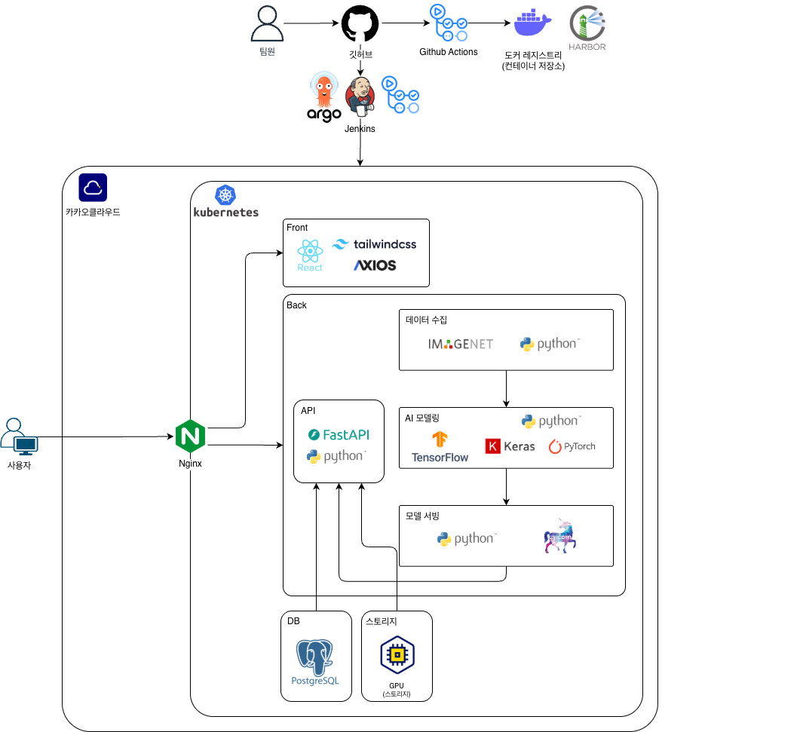

# AGAMI

> AI로 가득한 디지털 환경 속에서, 인간성을 식별하기 위한 CAPTCHA 시스템

<br>

## Overview

기존 CAPTCHA는 이미지 클릭이나 문자 입력 중심의 정적인 방식에 의존하고 있으며,  
최근 Vision-Language Model(VLM)과 생성형 AI의 발전으로 인해 우회 가능성이 증가하고 있다.

AGAMI는 단순 정답 검증이 아닌:

- 행동 패턴
- 상황 맥락 이해
- 실시간 반응

을 기반으로 인간과 AI를 구별하는 차세대 CAPTCHA 시스템을 목표로 한다.

<br>

## Main Features

### Flashlight CAPTCHA

어두운 화면 속에서 손전등 형태의 시야를 움직이며 목표 객체를 탐색하는 CAPTCHA

- 마우스 궤적 분석
- 비선형 움직임 탐지
- 인간 특유의 탐색 패턴 활용

---

### Context CAPTCHA

단순 표정이 아닌 상황과 맥락을 기반으로 감정을 추론하는 CAPTCHA

예시:
- 기쁨의 눈물
- 슬픔을 숨기는 웃음
- 체념
- 민망함
- 안도감

---

### Real-time Face Mission

사용자에게 랜덤 안면 미션을 부여하여 실시간 반응 검증

예시:
- 오른쪽 눈 감기
- 고개 돌리기
- 특정 방향 바라보기

---

### Behavior Analysis

CAPTCHA 수행 과정에서 발생하는 행동 데이터를 기반으로 인간/봇 판별

분석 요소:
- 이동 거리
- 평균 속도
- 방향 변화량
- 멈춤 횟수
- 반응 시간

<br>

## Architecture



<br>

## Tech Stack

### Frontend
- React
- TailwindCSS
- Axios

### Backend
- FastAPI
- Python

### AI / Data
- PyTorch
- TensorFlow
- Keras
- OpenAI API
- Scikit-learn

### Infra
- Docker
- Kubernetes (K3s)
- GitHub Actions
- Jenkins
- ArgoCD
- KakaoCloud

### Database
- PostgreSQL

<br>

## Project Structure

```text
agami/
├── frontend/
├── backend/
├── model/
├── dataset/
├── mouse_logs/
├── k8s/
├── docs/
└── README.md
